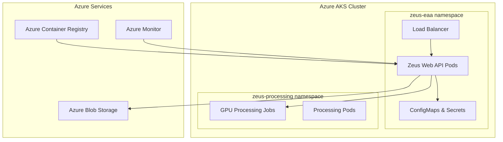

# Zeus EAA Compliance Tool - AKS Deployment Guide

## 🚀 Quick Deployment

Deploy the Zeus EAA Compliance Tool to Azure Kubernetes Service (AKS) with GPU acceleration for enterprise-scale video processing.

### Prerequisites

- **Azure CLI** installed and authenticated (`az login`)
- **kubectl** installed
- **Docker** installed and running
- **Azure subscription** with contributor access

### Step 1: Environment Setup

Run the automated environment setup script:

```bash
./setup-environment.sh
```

This creates all required Azure resources:
- ✅ **Resource Group** for organizing resources
- ✅ **AKS Cluster** with auto-scaling (2-10 nodes)
- ✅ **GPU Node Pool** for video processing (0-5 nodes)
- ✅ **Azure Container Registry** for Docker images
- ✅ **Storage Account** with blob containers
- ✅ **Service Principal** for authentication

### Step 2: Set Environment Variables

After setup completes, set the required environment variables:

```bash
# Copy from setup script output
export RESOURCE_GROUP="zeus-rg"
export AKS_CLUSTER="zeus-aks-cluster"
export ACR_NAME="zeusregistry"
export STORAGE_ACCOUNT_NAME="zeusstorage123456789"
export STORAGE_ACCOUNT_KEY="your-storage-key"
export AZURE_SUBSCRIPTION_ID="your-subscription-id"
export AZURE_TENANT_ID="your-tenant-id"

# Service Principal (get from Azure portal)
export AZURE_CLIENT_ID="your-client-id"
export AZURE_CLIENT_SECRET="your-client-secret"
```

### Step 3: Deploy to AKS

Deploy to staging environment:

```bash
./deploy-to-aks.sh staging
```

Or deploy to production:

```bash
./deploy-to-aks.sh production
```

The deployment script will:
1. ✅ **Build** and push Docker image to ACR
2. ✅ **Configure** AKS credentials
3. ✅ **Create** Kubernetes secrets
4. ✅ **Deploy** all manifests (namespace, RBAC, deployment, service, HPA)
5. ✅ **Wait** for pods to be ready
6. ✅ **Run** health checks
7. ✅ **Display** access information

## 🌐 Accessing the Application

After successful deployment:

- **🎬 Web Interface**: `http://[EXTERNAL-IP]`
- **📖 API Documentation**: `http://[EXTERNAL-IP]/docs`
- **🔍 Alternative Docs**: `http://[EXTERNAL-IP]/redoc`

## 📊 Architecture Overview



## 🔧 Key Components

### Web API Deployment
- **3 replicas** with auto-scaling (2-20 pods)
- **Load balancer** with external IP
- **Health checks** and readiness probes
- **Resource limits**: 2 CPU, 4GB RAM per pod

### GPU Processing
- **Dedicated namespace** for video processing jobs
- **GPU node pool** with NVIDIA Tesla T4
- **Auto-scaling** based on job queue
- **Spot instances** for cost optimization

### Security
- **RBAC** with minimal permissions
- **Service accounts** with workload identity
- **Secrets management** for credentials
- **Non-root containers** with security contexts

### Monitoring
- **Health endpoints** for load balancer
- **Prometheus metrics** (ready for scraping)
- **Structured logging** with correlation IDs
- **Resource monitoring** with HPA

## 🛠️ Management Commands

### Check Deployment Status
```bash
kubectl get all -n zeus-eaa
kubectl get pods -n zeus-eaa -w
```

### View Logs
```bash
kubectl logs -l app.kubernetes.io/component=web-api -n zeus-eaa --tail=100
```

### Scale Deployment
```bash
kubectl scale deployment zeus-web-api --replicas=5 -n zeus-eaa
```

### Update Image
```bash
kubectl set image deployment/zeus-web-api zeus-web-api=zeusregistry.azurecr.io/zeus-web-api:new-tag -n zeus-eaa
```

### Port Forward (for testing)
```bash
kubectl port-forward service/zeus-web-api-internal 8080:8000 -n zeus-eaa
```

## 💰 Cost Optimization

### Resource Scaling
- **HPA** automatically scales pods based on CPU/memory
- **Cluster autoscaler** adds/removes nodes as needed
- **GPU nodes** scale to zero when no jobs running
- **Spot instances** provide up to 90% savings

### Monitoring Costs
```bash
# Check node utilization
kubectl top nodes

# Check pod resource usage
kubectl top pods -n zeus-eaa

# View HPA status
kubectl get hpa -n zeus-eaa
```

### Cost Estimates
| Configuration | Monthly Cost | Use Case |
|---------------|--------------|----------|
| **Staging** | $200-500 | Development, testing |
| **Production (Small)** | $500-1,500 | <1000 videos/month |
| **Production (Large)** | $2,000-10,000 | >10,000 videos/month |

## 🚨 Troubleshooting

### Common Issues

**Pods stuck in Pending:**
```bash
kubectl describe pod <pod-name> -n zeus-eaa
# Check node capacity and resource requests
```

**Image pull errors:**
```bash
# Check ACR integration
az aks check-acr --name zeus-aks-cluster --resource-group zeus-rg --acr zeusregistry
```

**External IP not assigned:**
```bash
# Check service status
kubectl describe service zeus-web-api -n zeus-eaa
```

**Health check failures:**
```bash
# Check pod logs
kubectl logs -l app.kubernetes.io/component=web-api -n zeus-eaa
```

### Debug Commands
```bash
# Get cluster info
kubectl cluster-info

# Check node status
kubectl get nodes -o wide

# View events
kubectl get events -n zeus-eaa --sort-by='.lastTimestamp'

# Check resource usage
kubectl describe nodes
```

## 🔄 Updates and Maintenance

### Rolling Updates
The deployment uses rolling updates with zero downtime:
- **Max surge**: 1 additional pod during update
- **Max unavailable**: 1 pod can be unavailable
- **Readiness probes** ensure traffic only goes to ready pods

### Backup Strategy
- **Configuration**: Store in Git (Infrastructure as Code)
- **Secrets**: Use Azure Key Vault integration
- **Data**: Azure Blob Storage has built-in redundancy
- **Database**: Not applicable (stateless application)

### Monitoring and Alerts
- **Health endpoints**: `/health` for load balancer checks
- **Metrics endpoint**: `/metrics` for Prometheus scraping
- **Log aggregation**: Azure Monitor or ELK stack
- **Alerting**: Set up alerts for pod failures, high CPU, memory usage

## 📞 Support

### Getting Help
- **Logs**: `kubectl logs -l app.kubernetes.io/component=web-api -n zeus-eaa`
- **Status**: `kubectl get pods -n zeus-eaa`
- **Events**: `kubectl get events -n zeus-eaa`
- **Describe**: `kubectl describe deployment zeus-web-api -n zeus-eaa`

### Useful Links
- **Azure AKS Documentation**: https://docs.microsoft.com/en-us/azure/aks/
- **Kubernetes Documentation**: https://kubernetes.io/docs/
- **Azure Container Registry**: https://docs.microsoft.com/en-us/azure/container-registry/

---

**🎉 Your Zeus EAA Compliance Tool is now running on enterprise-grade Azure Kubernetes Service with auto-scaling, GPU acceleration, and high availability!**
